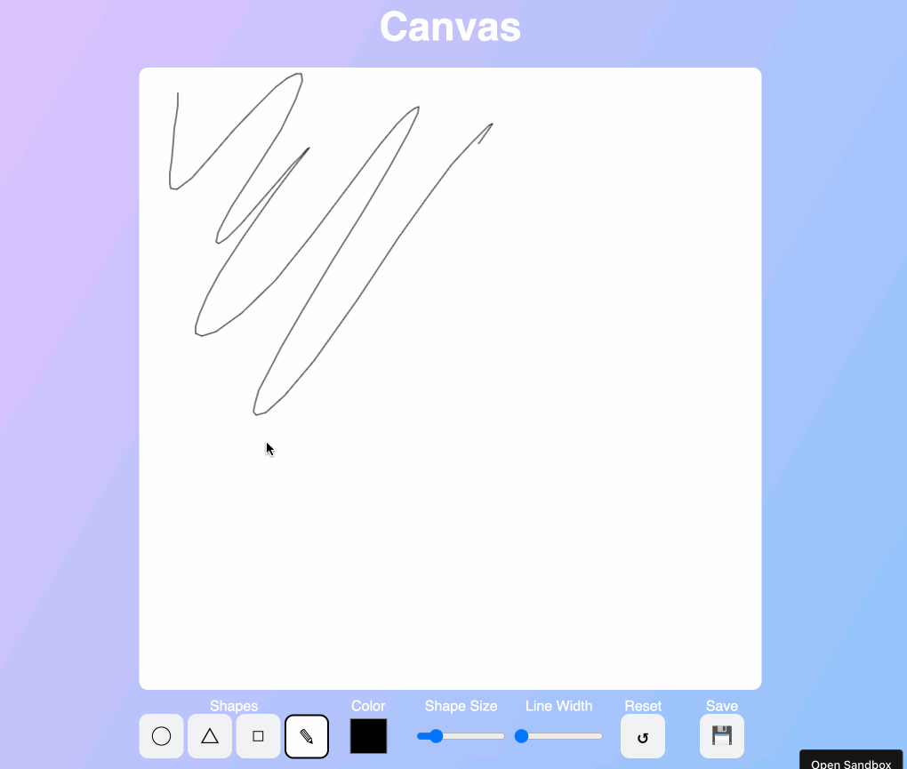
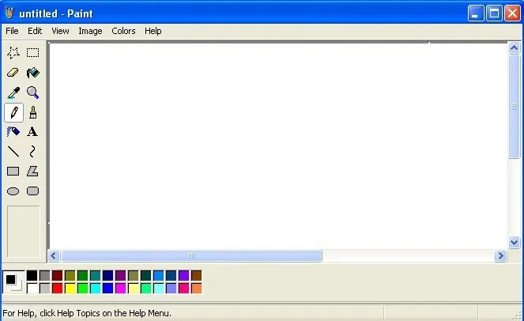

# Class 12

Canvas drawing

Programming Interactivity

 ----

Harbour Space

---

### How did yesterday's project go?

Note:
- Did you do any new nice interactive drawings.

---

## Agenda

01/ This week schedule

02/ Class Final Project

03/ Excercise

---

### This week schedule

- Monday: Canvas drawing shapes
- Tuesday: Canvas drawing
- Wednesday: Practical class
- Thursday: Practical class
- Friday: Class Final Project presentation 

---

## 01/ Class Final Project

---

### Class Final Project

We will combine everything we have learned into one page

You can decide what you want to create. It can be a CV page, landing page for your future startup or a design you have kept away and want to impliment

Note:
- show Notion document

---

### Class Final Project

Is 50% of final grade

- Turn in your ***code***
- ***Text document*** that explains your page and what points you are aiming for
- ***Presentation*** on Friday

---

### Todays excercise will be a drawing application

Note:
- Today we are going to continue with drawing on a canvas.
- Today we are going to create a canvas drawing application, something like this.
- Its not required to do all of these methods, but at least drawing, changing color and clearing the canvas.

---

### Looks similar

Note:
- We are basically re creating the basic functionality of Paint.

---

## 03/ Excercise

Note:
- So lets do it!