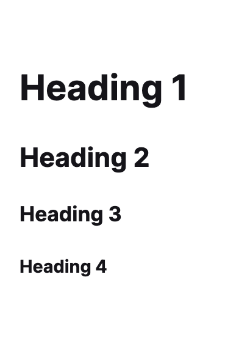
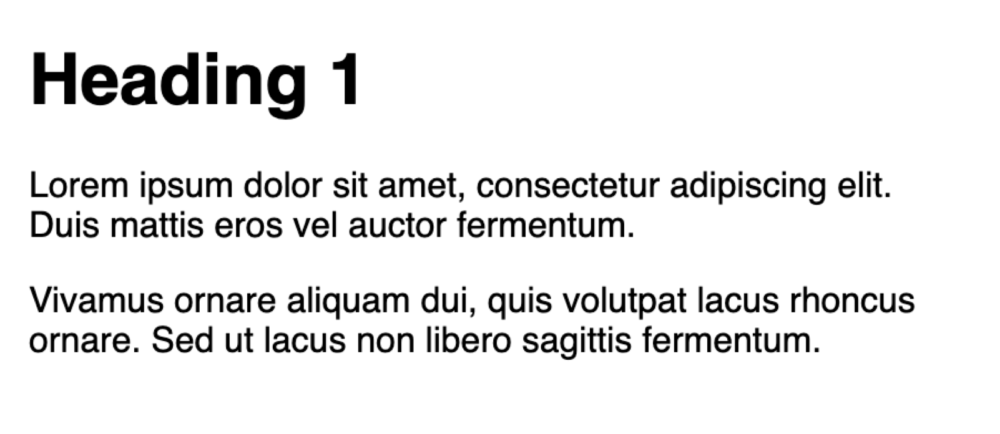
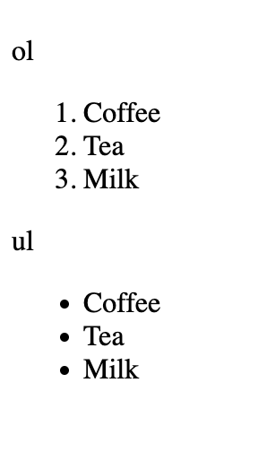
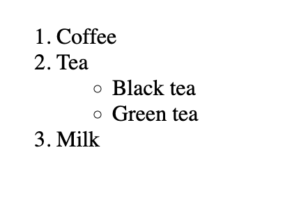
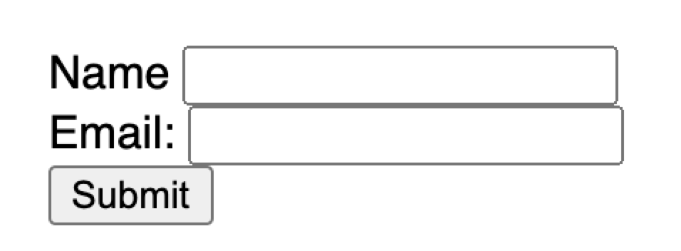

# Class 2

HTML foundation

Programming Interactivity

 ----

Harbour Space

---
## Agenda

<div style="text-align: left;">


01/ What is HTML

02/ Common HTML Tags and Elements

03/ Semantics

04/ Forms and User Interaction

05/ Exercise
</div>

---

## 01/ What is HTML

---

### About

***HTML (HyperText Markup Language)*** is the most basic building block of the Web.


It defines the maning and structure of web content.

Note: 
- HTML (HyperText Markup Language) is the most basic building block of the Web.
- It defines te maning and structure of web content.
- Its a plaintext document structured with elements.

---

## Basic HTML example

``` html [1-21|1|2,24|4-6|7,22|8,14|15,18|19-21|9|10-13|15,18|16-17|19-21]
<!DOCTYPE html>
  <html lang="en">

    <head>
      <title>Apple Watch Series 6</title>
    </head>
    <body>
      <header>
        
        <nav>
          <a href="/..">Specs</a>
          <a href="/..">Order now</a>
        </nav>
      </header>
      <main>
       <h1>The future on your wrist.</h1>
        <p>Measure your blood oxygen...</p>
      </main>
      <footer>
        Copyright
      </footer>
  </body>

</html>
```

Note: 
- This is an example of a basic HTML
- Elements are surrounded by matching opening and closing tags.
- `<!DOCTYPE html>` It start with the doctype tag that tells the browser that this is a HTML 5 doctype
- Then we have the `<html>` tag, that is the root tag
- Then we have some semantic tags that tell us the semantics of the page.
- The `<head>` tag that contains the links and metadata
- and `<body>` that has all visible elements
- And inside the body we have `<header>`
- `<main>`
- and `<footer>`
- and as you see, each of them wraps its content


---

### Tags

``` html
<h1>This is the title of my website</h1>
```

Note: 
- HTML Tags are the basic building blocks for websites. It describes what it contains.
- Every tag has an opneing and closing tag. The closing tag has a slash at the start.
- But as with any rule, there are a few exceptions.

---

``` html [1|2]
<h1>Hello</h1>
<br/>
```

Note: 
- This has a opnening and a closing tag. 
- And here we have a self closing tag, as it does not need to have any content.

---

### Example of self closing tags

``` html
<input/>
<br/>

```

Note: 
- Here is an example of some self closing tags. That dont have any Enclosed text content.

---

``` html
<div>
  <p>Here is some text</p>
  
  <p>Here is some more text</p>
</div>
```

Note:
- Here we have a div, that contains a text and an image. 
- As you can see the image tag does not need a closing tag, as it has no "Enclosed text content"

---

``` html [1-5|1,5|2-4|1-5]
<div>
  <h1>
    Hi
  </h1>
<div>
```

Note: Tags need to open and close in a specific order. They are containers and other tags nest under them.

---

## What is wrong here?

``` html
<div>
  <h1>
    H1
  </div>
</h1>
```

Note:
- This is not correct!
- I cant close the div until I close the h1.

---
### Attributes

- All HTML elements can have attributes
- Attributes provide additional information about an element
- Attributes are always specified in the start tag
- Attributes usually come in name/value paris like name="value"

``` html
<div class="container"></div>
```

Note:
- All HTML elements can have attributes
- Attributes provide additional information about an element
- Attributes are always specified in the start tag
- Attributes usually come in name/value paris like name="value"
- Each element has a different set of attributes

---

### More examples of Attributes

``` html [1-2|1|2]
<a href="https://www.example.com"></a>


```

Note: 
- the link address is specified in the href attribute of a <a> tag
- The filename of an image source is specified in the src attribute of a  tag. As well as width and height can be set. As well as a alt attribute, which is shown if image can not be displayed and used for screen readers.
- 

---

### More examples of Attributes

``` html [1-3|1|2|3]
<p style="color: red;">This is a paragraph.</p>
<p class="left-section">This is a paragraph.</p>
<p id="history-paragraph">This is a paragraph.</p>
```

Note:
- There is the style attribute
- The class attribute, that is used to specify the CSS class of an element
- And the id attribute, this must be unique

---

## HTML is not a programming language. It's a markup language.

Note: 
- HTML is a markup language because it is used to structure and present content, not to write programs that perform logic or actions.

---

## Roles

***HTML*** - What it says

***CSS*** - How it looks

***Javascript*** - How it behaves

Note:
- HTML is what it says, the structure of the page
- CSS - How it looks
- Javascript - How it behaves

---

## 03/ Common HTML Tags and Elements

---

### Docktype

All HTML documents must start with a <!DOCTYPE> declaration.

``` html
<!DOCTYPE html>

```
It is an "information" to the browser about what document type to expect. 


Note: 
- The declaration is not an HTML tag. It is an "information" to the browser about what document type to expect. 
- This tells the browser that this is HTML 5.

---


### Headings

``` html
<h1>Heading 1</h1>
<h2>Heading 2</h2>
<h3>Heading 3</h3>
<h4>Heading 4</h4>
<h5>Heading 5</h5>
<h6>Heading 6</h6>
```




Note: There are six levels of headings and subheadings you can have.

---

### Paragraph

``` html
<h1>Heading 1</h1>

<p>Lorem ipsum dolor sit amet, consectetur adipiscing elit. Duis mattis eros vel auctor fermentum.</p>

<p>Vivamus ornare aliquam dui, quis volutpat lacus rhoncus ornare. Sed ut lacus non libero sagittis fermentum.</p>
```



Note:
- You'll put a paragraph of text inside of a p tag. Only text goes in p tags. Each one of a paragraph is a seperate `<p>` tag.

---

### Anchor

``` html
<a href=“https://www.example.com”>
  This is a link
</a>
```


Note: 
- An a tag is a link to somewhere else. Every a tag needs a destination of where the link should take you.
- has the href attribute

---

### Image

``` html

```


Note: 
- You use this to load images into the page. This can be confusing as you can use CSS to bring images too.
- The key difference is that when the image is apart of the content, lika a diagram that shows data. You're talking about or a picture that shows something from the article, it should be a img tag.
- If it's a nice background image or something that's for decoration of your webpage, use CSS.
- In img tag needs a `src` attribute to say where the image is coming from.
- And an `alt` tag to say what is in the image for screen readers

---


### div

``` html
<div class="wrapper">
  <h1>You can put everything in here.</h1>
</div>
```

Note:
- Div is a short for division. A div is sort of like a cardboard box. Its not really anything by itself, it more defines what is in it.
- Its a generic container tag for grouping together other things. You'll use a lot of divs. Very useful with CSS.
- Its a block scoped element, so it takes the whole width of it container and starts a new line.

---

### span

``` html
<p>Here is a paragraph with <span>red</span> text</p>
```

Note: 
- A container for small pieces of text.
- If a div is like a cardboard bis, a span is like a Ziplock bag.
- Span is an inline element. So it does not start a new line.

---

### List - ul / ol

``` html
<ol>
  <li>Coffee</li>
  <li>Tea</li>
  <li>Milk</li>
</ol>

<ul>
  <li>Coffee</li>
  <li>Tea</li>
  <li>Milk</li>
</ul>
```




Note: 
- This is a list tag. We can use ol for a numbered list and ul for a bullet list.
- ol an ul is the wrapper and li is each point.

---

### Nested lists

``` html [1-10|1,10|4-7|1-10]
<ol>
  <li>Coffee</li>
  <li>Tea
    <ul>
      <li>Black tea</li>
      <li>Green tea</li>
    </ul>
  </li>
  <li>Milk</li>
</ol>
```



Note: 
- Its also possible to next these lists

---


## HTML Elements - There are many, many more...

Note: 
- I don't expect you to be a dictionary of all the html tags there are. Im just telling you about some basic ones and then its possible to read more about them.

---
## 03/ Semantics

Note: Lets look at Semantics

---

## What are semantics?
The meaning of elements

Most HTML elements clearly define their contents. Other elements are non-semantic.

Note:
- Semantic elements are elements with a meaning.

---

### Semantic elements
``` hmtl
<header>, <footer>, <nav>, <article>, <section>, 
<h1>, <h2>, <h3>, 
... more
```

### Non-semantic

``` html
<div>
<span>
```

Note: 
- A semantic element clearly describes its meaning to both the browser and the developer.
- div and span are good examples of non semantic elements. They tell nothing about its content but are often used for styling elements.
- form, table and article, are good examples of semantic elements as they clearly define its content.

---


Note: 
- Here is a good example of non semantic tags on the left where divs are only being used.
- and on the right we see a good use of Semantic HTML.

---

## Why semantics matter?

- Tells search engines the meaning and importance of elements (SEO)
- Tells browsers and screen readers about meaning for accessibility.


Note: 
- Tells search engines the meaning and importance of elements (SEO). Semantic HTML tags help search engines understand the importance and context of web pages. 
- Tells browsers and screen readers about meaning for accessibility.
- 

---

## Semantic tags

---


### header, main, footer

``` html [1-9|1-3|4-6|7-9]
<header>
  header content
</header>
<main>
  main content
</main>
<footer>
  footer content
</footer>
```

Note: 
- the `header` element specifies a header for a document or section. Should be used as a container for introductory content.
- the `main`, specifies the main content of a document
- the `footer` spcifies a footer for a document or section. A footer typically contains teh author of the document, copyright information, links to term of use, contact information.

---


### nav

``` html
<nav>
  <a href="/html">HTML</a>
  <a href="/css">CSS</a>
  <a href="/js">JS</a>
</nav>

```

Note: 
- defines a set of navigation links

---

### Header, Nav, Main, Footer

``` html [1-14|1,7|3,6|8,11|12,14]
    <header>
      <h1>Title</h1>
      <nav>
        <a href=“#”>Nav link 1</a>
        <a href=“#”>Nav link 2</a>
      </nav>
    </header>
    <main>
      <h1>Heading</h1>
      <p>Text</p>
    </main>
    <footer>
      Copyright
    </footer>
```

---

### Section

``` html
<section>
  <h1>WWF</h1>
  <p>Let’s safe nature!</p>
</section>
```

Note: Defines a section in a document. A section is a thematic grouping, typically with a heading.

---

### Article

``` html
<article>
    <h1>What Does WWF Do?</h1>
    <p>WWF's mission is to stop the degradation of our planet's natural environment, and build a futur in which humans live in harmony with...</p>
</article>
```

Note: An article should make a sense on its own, and it should be possible to read it independently from the rest of the web site. Like a blog post, forum post or newspaper article.

---

``` html
<header>
<main>
<footer>

<h1>
<nav>
<article>
<section>
```

Note: 
- These are the main semantic tags we went over. Dont be too afraid to not get them right, just know about them when you want to make your page SEO friendly.
- But concentrate on header, main and footer
---

### What is Search engine optimization

- Practise to organize your website's content and HTML to improve each page's organic rank
- ***Organic rank*** - means basically any unpaid result on search engines

Note: 
- Simply put, search engine optimization is the practise of organizing your website's content and HTML to improve each page's organic rank (organic rank means baically any unpaid result on search engines). 
- There are many factors, but the most common factor that you should consider is to schedule the content of the page.

---


## 04/ Forms and User Interaction

---

### Forms

``` html [1-13|1|3|4|11|1-13]
<form> 
    <div>
     <label for="name">Name</label>
     <input id="name" name="name" type="text" />
    </div>
  <div>
    <label for="email">Email:</label>
    <input id="email" name="email" type="email"/> 
  </div>
  <div>
    <input type="submit" />
  </div>
</form>
```



Note: 
- This is a form element, thats an element that is used to collect user input. The form is not visible
- The input element can be of many types. Here we have text that will be a text input.
- the label element defines the label for the input element. The label is useful for screen readers, as it will read outloud the label when the input is focused.
- The `for` of the label needs to match the `id` of the input

---

``` html
<input type="button">
<input type="checkbox">
<input type="color">
<input type="date">
<input type="datetime-local">
<input type="email">
<input type="file">
<input type="hidden">
<input type="image">
<input type="month">
<input type="number">
<input type="password">
<input type="radio">
<input type="range">
<input type="reset">
<input type="search">
<input type="submit">
<input type="tel">
<input type="text">
<input type="time">
<input type="url">
<input type="week">
```

Note: 
- There are many form input types
- We are not going to look at them all, but I might add  some to our project later

---

We are going to use CodeSandbox for our projects.


Note: We are going to use Codesandbox for our projects.


---

### Start small

Start adding one HTML tag at a time. Add the open and closing tag. Save and see if it works.

Then add the next tag

Note: 
- When writing HTML, try to just add one tag at a time. Add the opening and the closing tag and then add content inside.

---

### What is the most important skill as a developer?

---


Note:
- Its a good skill to be able to google yourself to your answer.
- For that we need a basic understanding of how things work, and after that the most important skill for a developer is to know how to seek information.
- Tech stacks change fast, and we are always just reading documentations, learning more and have all googled "how to center a div" way too many times.

---

## 07/ Excercise


