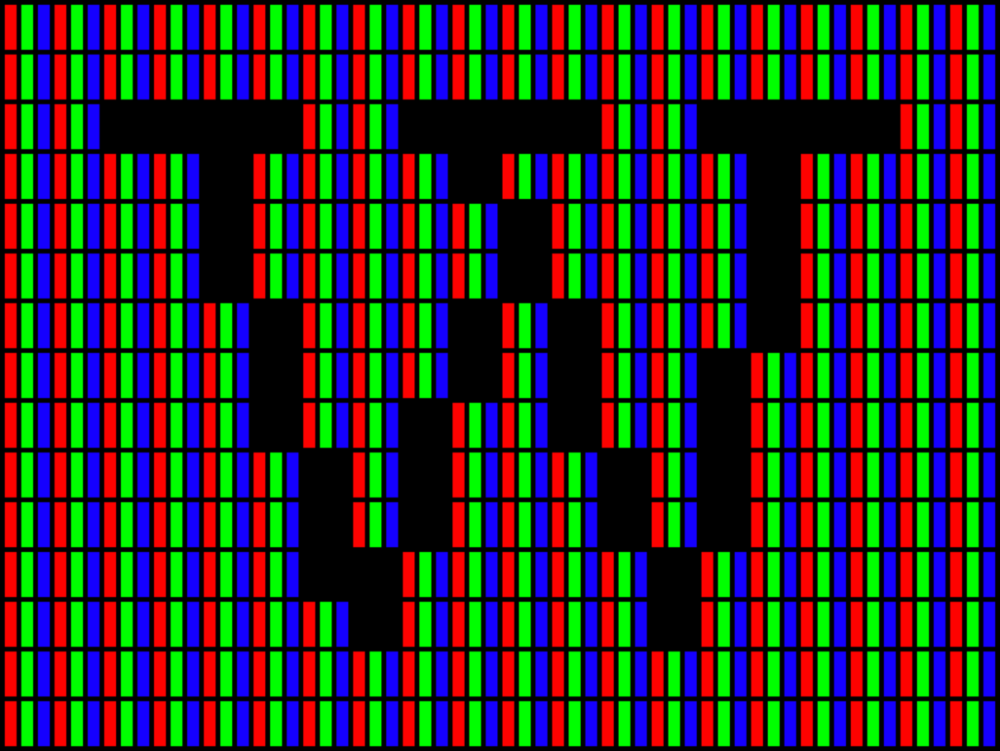
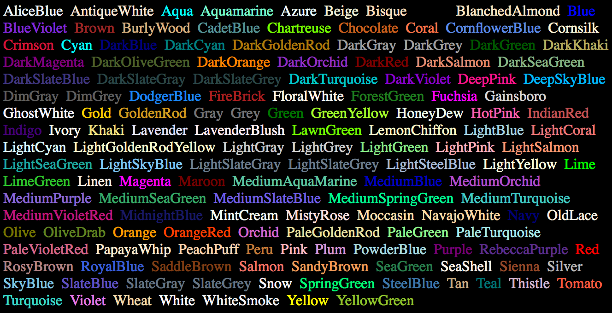
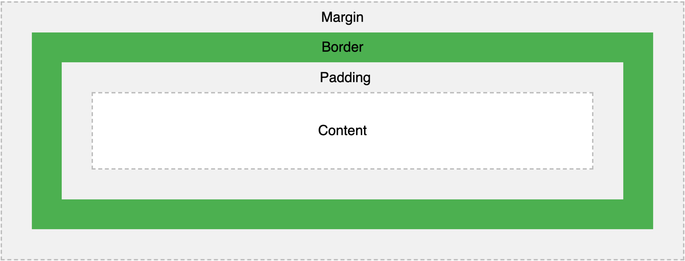
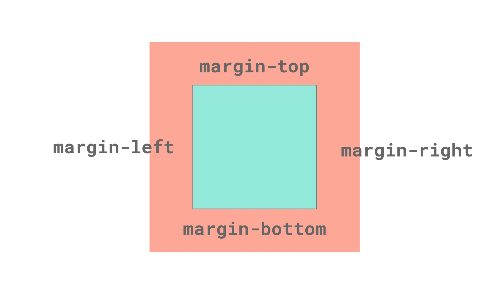
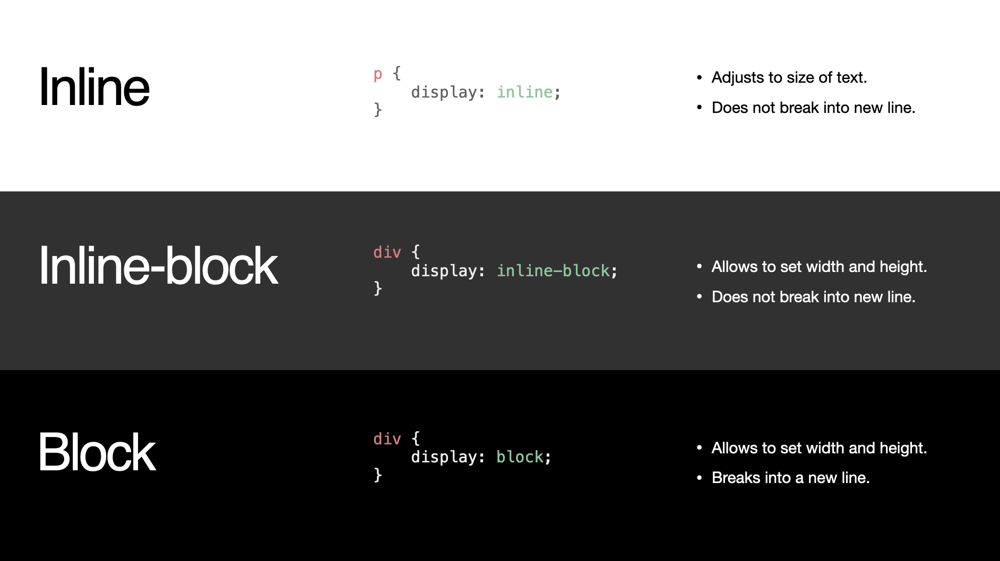

# Class 3

CSS Fundamentals

Programming Interactivity

 ----

Harbour Space

---

## Agenda

<div style="text-align: left;">

01/ CSS intro

02/ CSS Selectors

03/ CSS Rules

04/ Basic styling

05/ Box model

06/ Excersice

---

## 01/ CSS intro

---

## About CSS
<div style="text-align: left;">

***CSS*** stands for Cascading Style Sheet

***CSS*** describes how HTML elements are to be displayed in screen

***CSS*** can control the layout of multiple web pages all at once

---

## Basic CSS

``` css
body { 
  background-color: black; 
  color: white;
} 

h1 { 
  font-size: 40px;
  text-align: center; 
} 

p { 
  font-family: verdana, sans-serif; 
  font-size: 20px; 
}
```

Note: 
- This is an example of some basic CSS

---

## Note that we end every style with a semicolon ;

``` css
font-size: 40px;
```


Note:
- Think of it like a period/full-stop to end of a sentence. This is how the computer knows you're done with that property and moving on.
---

## HTML Reference

``` html
<link rel="stylesheet" href="/styles.css">
```

Note: 
- this is a HTML reference, this is a way that we can load the css to our html.
- Just like we did in our first Class project.

---

## also possible to add inline

``` html
<h1 style="color: blue">Hello</h1>
```

Note:
- It is also possible to ad styles inline, but I would not neccesary recommend it


---

## CSS - Hard to do well

Note:
- CSS is hard to do well.
- its easy to make it hard to understand
- principle is keep it simple, try to make it readable when writing it so it can be changed later.

---

# CSS Selectors

---

## Selectors

- Element selector (body)
- Class selector (.class_name)
- ID selector (#id_name)

Note: 
- When we want to add a style to an element, we need to select the element in the HTML.
- We do this by Selectors.
- We can select the element by the element, by the class or by the id

---

## Element Selector

``` html
h1 {
    color: blue;
}

<h1>Heading 1</h1>
```

Note: 
- Here is an element selector
- We have the header in the html and we can select it by this in the css.

---

## Class selector

```
.caption {
    color: red;
}

<span class="caption">Some text</span>
```

Note:
- Here we have the class selector
- We add the class in the html and select it in the css file
- We define the class select with a dot(.)

---

## ID selector

```
#about {
    background-color: pink;
}

<div id="about">
  ...
</div>
```

Id attributes in HTML need to be unique

Note:
- This is a id selector
- Then you need to add an id attribute to the HTML element
- And then you can select it in the css
- Id attributes in HTML need to be unique!

---

## Class selectors are the most common. Use element selector when changing styles to all elements of that type

---

## Only use ID selectors if you have a single element of that type. IDs also serve a functional purpose.

---

### Combining selectors

How it's possible to combine selectors.

---

### Combining selectors

``` css
/* style multiple elements at once */
h1,
h2,
h3,
h4 {
    color: blue;
}
```

Note:
- This is how we can combine selectors to select multiple elements at once

---

### Nested selectors

``` css
/* select h1 elements with .title class */
h1.title {
    color: blue;
}

/* select all anchors under p */
p a {
    color: blue;
}

/* select all direct childs of div, not grandchildren */
div > * {
    color: blue;
}

```

---

### TIP for simplicity — 
Avoid nested styles as it makes harder to read and reuse the CSS. Rather put classes on all elements that needs styling. 

---

## Psaudo classes

Providing different states for elements

---

## Pseudo classes (on links)

``` css
/* unvisited link */
a:link {
  color: #FF0000;
}

/* visited link */
a:visited {
  color: #00FF00;
}

/* mouse over link */
a:hover {
  color: #FF00FF;
}

/* selected link */
a:active {
  color: #0000FF;
}

<a href="https://cnn.com">CNN</a>
```

---

## Pseudo classes (on elements)

``` css
/* generic styles */
.item {
  width: 100px;
  height: 100px;
  background-color: hotpink;
}
/* style first element */
.item:first-child {
  background-color: hotpink;
}

/* style last element */
.item:last-child {
  background-color: aqua;
}

<div class="item"></div>
<div class="item"></div>
<div class="item"></div>
<div class="item"></div>
```

Note:
- This can often be useful if you have many items together with a margin and dont want it on the last one, or a border

---

# CSS Rules

---

## The cascade

The order of CSS rules matter

The one that comes last in the CSS is the one that will be used if its the same selector

Note:
- The order of CSS rules matter
- The one that comes last in the CSS is the one that will be used if its the same selector. But it could be different if its a higher ranking selector.


---

## The cascade

``` [1-6|4-6]
h1 { 
    color: red; 
}
h1 { 
    color: blue; 
}
```

Note: the later one will be selected

---

## Specificity

The selector with highest specificity wins.

1. ID selector (#id_name)
2. Class selector (.class_name)
3. Element selector (body)

---

## Specificity 

```css [1-9|3-5]
<h1 id=“id” class=“title”>Heading 1</h1>

.title { 
    color: red; 
}
        
h1 { 
    color: blue; 
}
```

Note: 
- .title class will win because that has a higher specification.
- This is something to have in mind and can be annoying to debug, especially when working with some global styles.
- But luckily the global style pattern is dissapearing with component based development.

---

## Inheritance

CSS property values set on parent elements are inherited by their child elements, and some aren't.

---

## Inheritance

``` css
body {
    color: blue;
}

span {
    color: black;
}

<p>As the body has been set to have 
a color of blue this is inherited through 
the descendants.</p>

<p>We can change the color 
  by targetting the element with a selector, 
  such as this <span>span</span></p>
```

---

# Basic styling

---

## Colors

---



---

## Named colors

``` css
h1 {
    color: hotpink;
}
```



Note:
- There are many named colors that is possible to use

---

## HEX colors

``` css
h1 {
    color: #FF69B4;
}
```

---

## RGB/RGBA Colors

```
h1 {
    color: rgb(255, 105, 180);
}
```

---

## Units

---

## Pixels

An absolute unit representing a "dot" on the display


---

## Pixels

``` css
div {
  width: 400px;
  height: 400px;
}
```
---

## Percentage

A unit relative to the width or height of it's parent container.

---

## Percentage

``` css
div {
  width: 50%;
  height: 50%;
}
```

Note: Relative to the size of the container

---

## Typography

---

## Font family

---

## Font family

<div style="text-align: left;">

- Specifies the font.

- Includes fallback fonts in order after comma.

- There are many websafe fonts that you dont need to load in specifically

- Google fonts is an example library of free custom fonts.

Note: 
- The font-family prop specifies the font that is used.
- It is possible to add fallback fonts after the comma
- There are many websafe fonts out there that can be good to use as a fallback
- Google font is an example libaray of free custom fonts, you just need to load them in manually. But its possible to do that by adding a link tag in the head

---

## Font family

``` css
h1 {
  font-family: 'Roboto', sans-serif;
  font-size: 20px;
}
```

---

## Font size


---

## Font size

``` css
h1 {
  font-size: 36px;
}

h2 {
  font-size: 32px;
}

h3 {
  font-size: 26px;
}
```

---

## Font weight

Weights are both numerical and named

<div style="text-align: left;">

Examples:
- 200: light
- 400: normal
- 600: semi bold
- 700: bold

---

## Font weight

``` css
h1 {
  font-size: 36px;
  font-weight: bold;
}

h2 {
  font-size: 32px;
  font-weight: normal;
}

h3 {
  font-size: 26px;
  font-weight: 200; /* Light */
}
```

---

## Font styles

<div style="text-align: left;">

- text-align
- line-height
- letter-spacing
- text-transform
- text-decoration
- more ...

---

## Text transform

``` css
p {
  text-transform: uppercase; 
  // HELLO THERE
}

p {
  text-transform: lowercase; 
  // hello there
}

p {
  text-transform: capitalize; 
  // Hello There
}

```

---

## Text decoration

``` css
h1 {
  text-decoration: overline;
}

h2 {
  text-decoration: line-through;
}

h3 {
  text-decoration: underline;
}

h4 {
  text-decoration: underline overline;
}

```

---

## Text align

``` css
p {
  text-align: center;
}

p {
  text-align: left;
}

p {
  text-align: right;
}

p {
  text-align: justify;
  // Stretches the lines so that each line has equal width 
  (like in newspapers and magazines)
}

```

---

## Letter spacing

``` css
h1 {
  letter-spacing: 3px;
}

h2 {
  letter-spacing: 2px;
}

h3 {
  letter-spacing: -1px;
}
```

---

## Set defaults on body

``` css
body {
	font-family: georgia, sans-serif;
	color: white; // font color
}
```

Note:
- Default styles you want to use across the whole page can be set to the body tag. 
- As that should surround the whole content of the page.
---

## Backgrounds

---

## Background color

``` css
div {
  background-color: hotpink;
}
```

---

## Background image

``` css
div {
  background-image: url('/myimage.jpg');
}
```

---

## Box model

---

## Box Model



---

## Box Model Example

``` css
div {
  width: 300px;
  height: 100px;
  border: 20px solid green;
  padding: 20px;
  margin: 20px;
}
```

Note:
- Draw on table

---

## Long

``` css
div { 
  width: 300px;
  height: 100px;

  border-style: solid;
  border-color: green;  border-top: 20px;  
  border-right: 20px;
  border-bottom: 20px;
  border-left: 20px;  padding-top: 20px;
  padding-right: 20px;
  padding-bottom: 20px;
  padding-left: 20px;

  margin-top: 20px;
  margin-right: 20px;
  margin-bottom: 20px;
  margin-left: 20px;
}
```

---

## Long



---

## Short, long, longest

``` css [1-4| ]
div {  
  margin: 20px;
  /* all sides */
}

div {
  margin: 20px auto; 
  /* top/bottom left/right */
}

div {
  margin: 20px 30px 20px 30px;   
  /* top, right, bottom, left */
}
```

---



---

## Recommended Defaults

``` css
* {
	margin: 0;
	padding: 0;
  box-sizing: border-box;
}
```

---

## Excercise