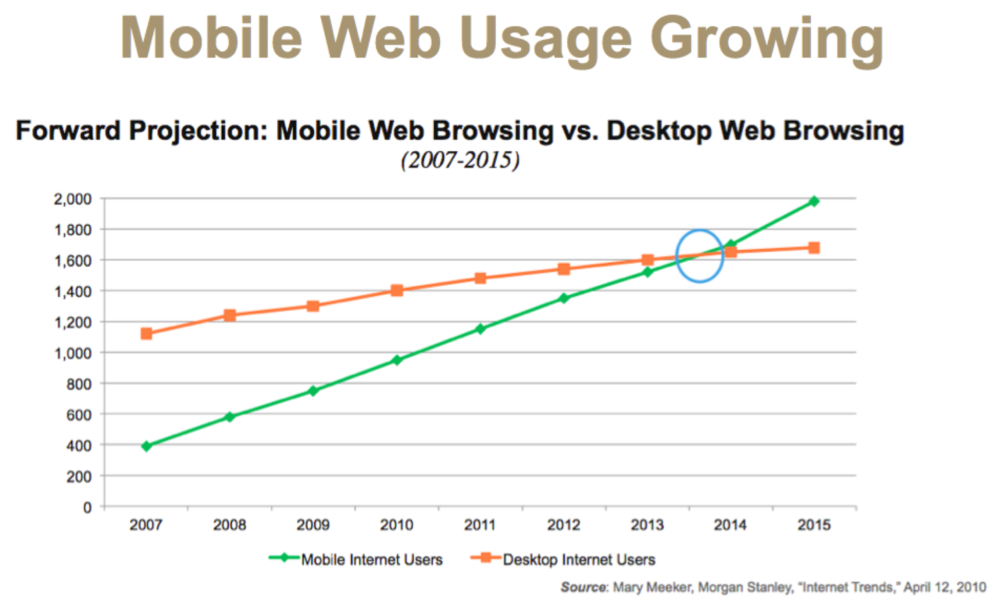
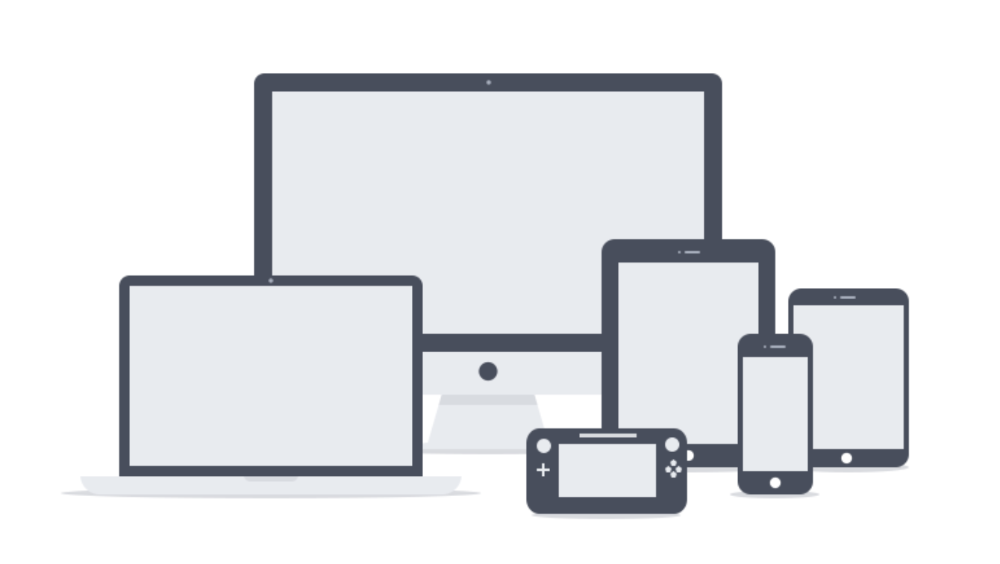
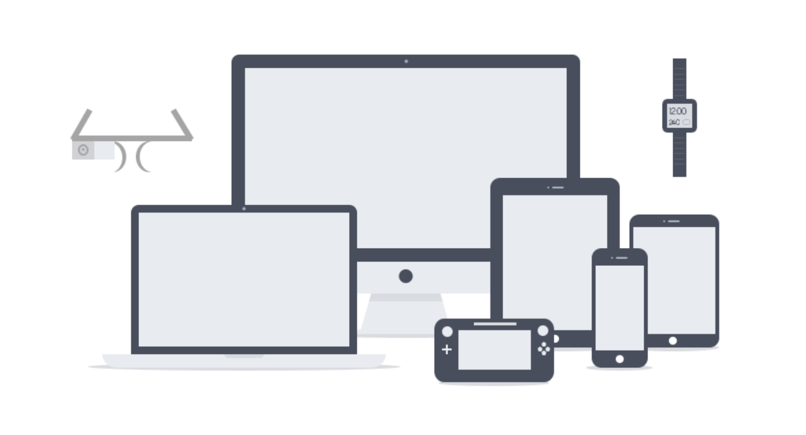
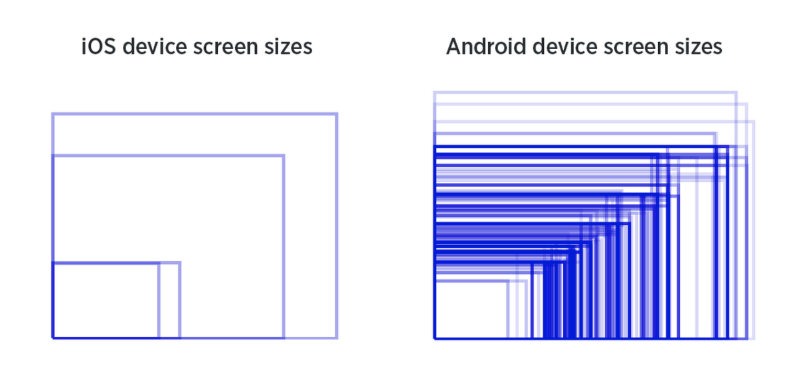
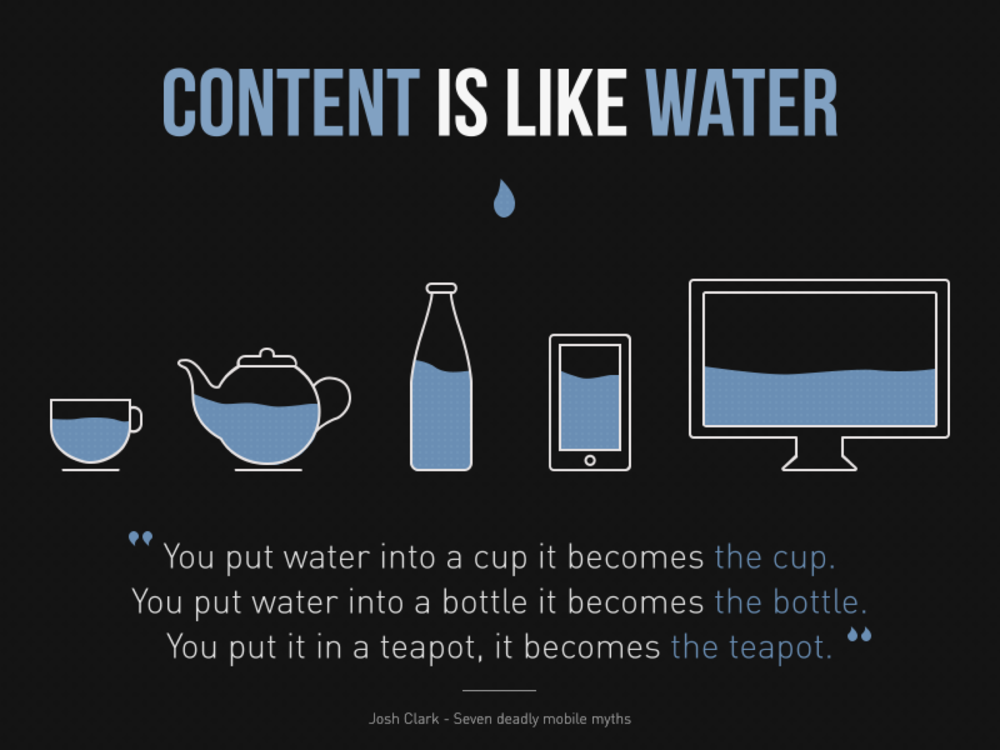
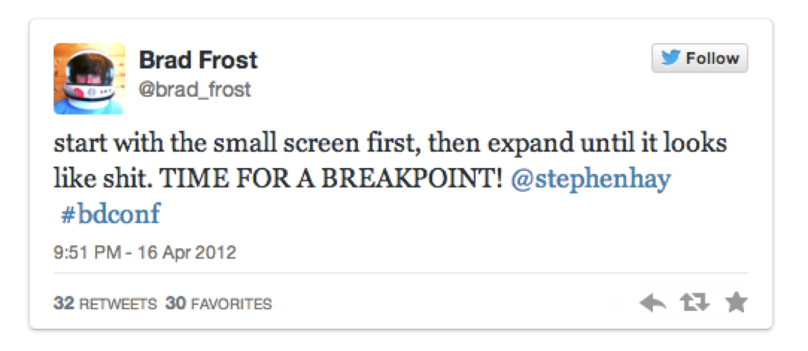

# Class 4

Responsive Web Design

Programming Interactivity

 ----

Harbour Space

---

## Agenda

01/ RWD Basics
02/ Methodology
03/ Layouts
04/ Media queries
05/ CSS Grid

---

## RWD Basics

---

## Mobile Web Usage growing



---

### Responsive viewport

``` css
<head>

...
<meta name="viewport" content="width=device-width, initial-scale=1">

</head>

```

Note: Responsive viewport

---

## Methodology

---

### Screens



---

### Screens



---

### Screens



---

## "There is no mobile tablet or desktop"

---


---



---

RWD side demo

Note:
- Lets look at some responsive sites

---



Note: 
- It can be a good approach to start developing for a mobile page and then adjust when it gets bigger

---

<section data-background-image="attachment/c4/start-small1.png" data-background-size="cover">

Note: Start small.

---

<section data-background-image="attachment/c4/start-small2.png" data-background-size="cover">

Note: Increase the width

---

<section data-background-image="attachment/c4/start-small3.png" data-background-size="cover">

Note: Identify problems

---

<section data-background-image="attachment/c4/start-small4.png" data-background-size="cover">

Note: Add a breakpoint and fix it

---

<section data-background-image="attachment/c4/start-small5.png" data-background-size="cover">

Note: Keep going

---

## 03/ Layouts

---

## Max Width

Great for flexible wrappers, to contain how far out they scale.

---

## Max width

``` CSS
main { 
    max-width: 800px; 
}
```

---

## Flexbox

Great to specify grids and control flow of content on different viewport sizes

---

## Flexbox

``` css
.container { 
    display: flex;
    justify-content: space-between;
}

<div class="container">
  <div class="sidebar"></div>
  <div class="main-content"></div>
</div>
```

---

## 04/ Media Queries

---

## Media

Add breakpoints to your CSS, at a certain viewport width.

---

## Media

``` css
@media (min-width: 600px) {
  
  
  /* Styles for bigger screens go here */

}
```

---

## Media

Media queries can be used to check many things, such as:
- Width and height of the viewport
- Width and height of the device
- Orientation (is the tablet/phone in landscape or portrait mode?)
- Resolution

---

## Excercise