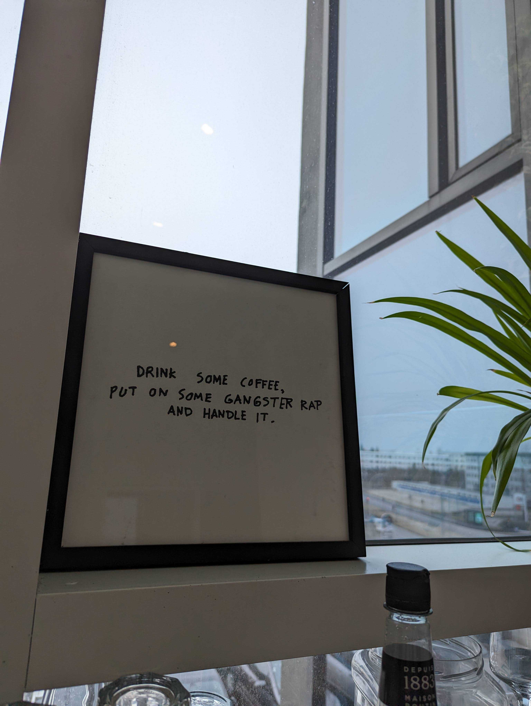

# Class 5

Week 1 Project

Programming Interactivity

 ----

Harbour Space

---

## This week topics

What is programming interactivity

HTML

CSS

Responsive Web Design

Note:
- This is what we have been learning this week
- Lets today combine this all into one project
- How to style a page. But dont worry, we don't learn this in one week. Now we just know the basics and now we can practise it. As CSS can be hard, and it requires practise

---

### Weekly Project 1

- 10% of final grade
- Presentation on Monday morning
- Your own code!
- Be creative and play around with it

Note:
- The Weekly project is 10% of final grade as we are going to combine everything we just learned this week.
- We will present our projects on monday morning.
- Look at notion project

---

### ChatGPT

---

### ChatGPT

Can be a useful tool to look for information

It can be useful to "chat" with ChatGPT

Note:
- Can be a useful tool to look for information
- It can be useful to "chat" with ChatGPT about problems you have
- but try to not let chatgpt do things for you!

---

### ChatGPT

- ***Ask:*** Can you tell my more about what my options are to center a `<h1>` tag inside of a `
` tag

- ***Don't*** ask: Can you create code for me for my webpage.

- Let it "teach" you, not do things for you!

Note:
- In this course I recommend not using it a lot, as we are looking at basic concepts that are good to practise.
- but it can be useful to use it like google, just to seek information
- For the Weekly projects, I want it to be your code and you to understand it, I might 

---

### Let ChatGPT make you smarter, don't let it do things for you!

---

