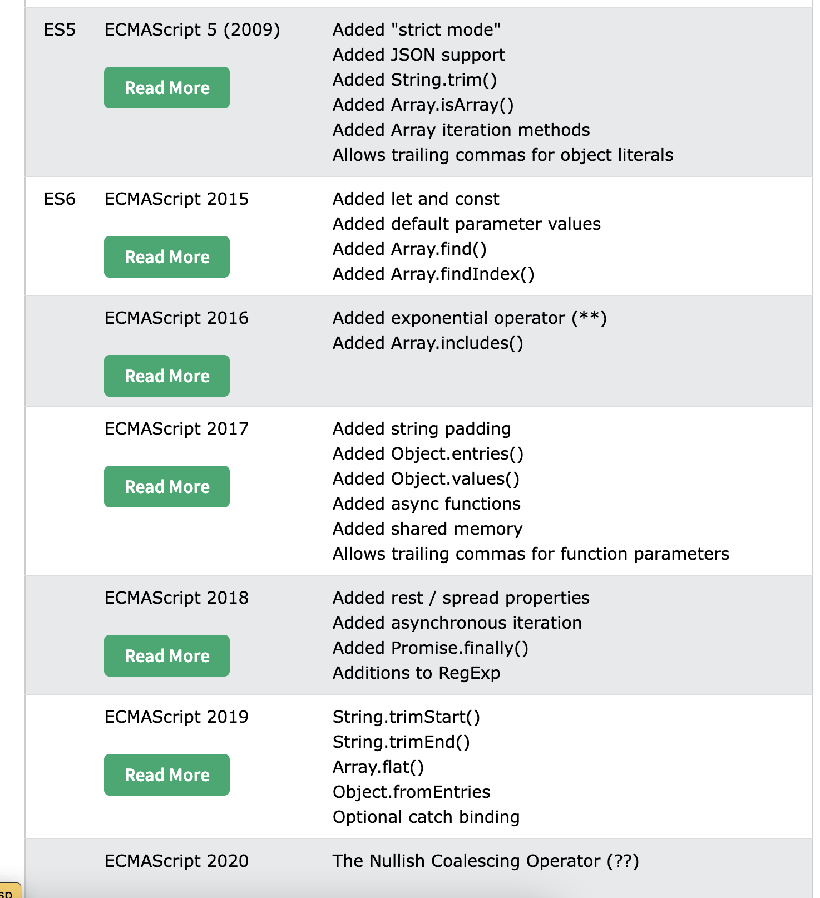
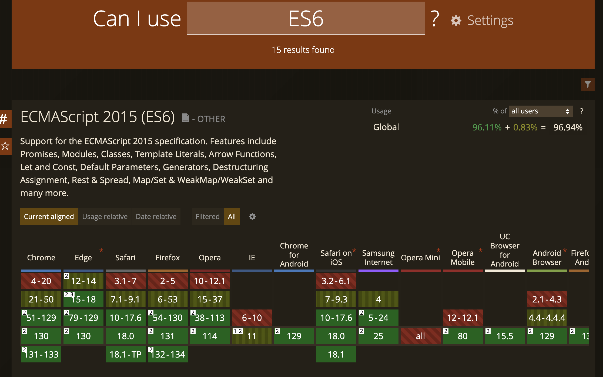

# Class 7

Javascript fundamentals

Programming Interactivity

 ----

Harbour Space

---

## Agenda

<div style="text-align: left;">

01/ Programming foundation

02/ Variables

03/ Data types

04/ Arithmetic operators

05/ Comparison operators

06/ Functions

07/ Array methods

08/ Excercise

---

## 01/ Programming foundation


---


## Hello World

``` js
const myHeading = document.getElementById('title');
myHeading.textContent = 'Hello world!';


/* HTML */
<h1 id="title">Text will show here!</h1>
```

Note:
- This is how we would do a Hello world from Javascript.
- We can find the header element and change the text content of it.

---

## HTML Reference

```
 <script src="./index.js" type="module"></script>
```

at the bottom of `<body>`

Note:
- This is how we can load the JavaScript into our HTML file
- Recommended to keep at the bottom of the body tag. So all HTML elements are loaded first before the javascript is loaded.

---

## EcmaScript

ECMAScript (ES) is standardized scripting language specification that forms the basis for modern web development languages like JavaScript


Note:
- Its good to know about this, as that will explain to us why there are different syntax out there that are possible to use. 

---

### ECMAScript vs JavaScript

<div style="text-align: left;">

Javascript was created 1995

ECMAScript 1 - ES1 was released in 1997 - was based on the Javascript language

Today Javascript follows the ECMAScript scripting language

Each version of ECMAScript introduces new features and improvements to JavaScript. ES5, ES6...

Note: 
- ECMAScript is essentially the official standard for JavaScript. It defines how the JavaScript language should work and what features it includes. When we talk about ECMAScript, we're talking about the rules, syntax, and core features that make JavaScript what it is.
- Each version of ECMAScript introduces new features and improvements to JavaScript. ES5, ES6...
- link to w3 school of versions

---



Note: 
- Here is an example of the latest releases
- Just to be noted, its not always safe to use the newest release as browsers need to get up to speed with supporting it.
- 

---



Note:
- Can be good to look up support for newest releases.
- But ES6, that came out in 2015 is for example with full support. And some things from the new 2020 release as well.

---

## 02/ Variables

Note:
- Lets talk about variables.

---

### Variable

Variables are used to store data that you can use and manipulate in your code.

Note:
- A variable is like a box that holds a value. You give the box a name, and then you can put things (like numbers, text, or objects) inside it to use later.
- You can then refer to this box by its name to retrieve or change the stored value.

---

``` js
const backgroundColor = "blue";
```

Note:
- This is an example of a variable, we can set and use, like in our background color project eysterday.
- Here we create the variable backgroundColor
- and we set it with the value "blue"

---

### Variable types

``` js
const z = 3.14;  // Declares a constant variable using const
let y = "Hello"; // Declares a variable using let
var x = 10;      // Declares a variable using var
```

Note:
- Here are the Javascript variable types. We have const, let and var. 
- const, declares a constant variable that cannot be changed after it is assigned. Its a good practise to use const for values that wont change.
- let, declares a variable that can be changed later
- var - is the old way to declare variables. It has some limitations in modern JavaScript and is generally not used a lot today.

---

### let

```
let myVariable;
myVariable = 'Bob';

myVariable = 'Siri';
```

Note: 
- Here we have an example
- we can change let later, multiple times
---

### const

```
const PI = 3.14159265359;

PI = 100; // NOT POSSIBLE!
```

Note:
- Here we have a good example of a constant variable
- That we do not need to change at any point.

---

### Variable names

***camelCase*** - variables in javascript by convention are written in camelCase

- Variable names can contain lettrs, numbers, underscore(_) and dollar signs($)
- Names cannot start with a number.

Note: 
- variables in javascript by convention are written in camelCase
- its also possible to write their name differently , fox with snake case(underscore between). But the convention has been to use camelCase
- Names cannot start with a number

---

### Scope of Variables

<div style="text-align: left;">


- ***let*** and ***const*** are block-scoped, meaning they are restricted to the nearest block { } they’re declared in. This makes them safer to use in loops or conditions because they won’t accidentally "leak" into other parts of the code.

- ***var*** is function-scoped, so it will only be limited to the function it’s in, even if it’s declared inside a block (like an if or for statement).

Note:
- ***let*** and ***const*** are block-scoped, meaning they are restricted to the nearest block { } they’re declared in. This makes them safer to use in loops or conditions because they won’t accidentally "leak" into other parts of the code.
- ***var*** is function-scoped, so it will only be limited to the function it’s in, even if it’s declared inside a block (like an if or for statement).

---

### Best practise for using variables

<div style="text-align: left;">

- Use ***const*** by default unless you know the value needs to change, then use ***let***
- Avoid using ***var*** in modern JavaScript as it has more unpredictable behaviour due to its function-scoping
- Choose clear, descripative names for variables to make your code easy to understand

Note:
- Use ***const*** by default unless you know the value needs to change, then use ***let***.
- Avoid using ***var*** in modern JavaScript as it has more unpredictable behaviour due to its function-scoping
- Choose clear, descripative names for variables to make your code easy to understand

---

## 03/ Data types

---

## Data types

JavaScript is dynamic in nature, meaning that variables and types are decided as assigned in run-time.

``` js
let variable = 42;      // Initially a number
variable = "Hello";     // Now it's a string
variable = true;        // Now it's a boolean
```

Note:
- So technically there is nothing stopping you from doing this.

---

### TypeScript

- Is a superset of Javascript that allows for type-checking at compile time.

- TypeScript is compiled down to JavaScript, enabling type-safe code that still runs in any JavaScript environment.

Note:
- This is the reason why its eally popular to write applications in Typescript
- TypeScript is a superset of javascript. 
- But TypeScript is compiled down to JavaScript, enabling type-safe code that still runs in any JavaScript environment.
- I love typescript as it tells me my errors while I write my code. But Im not going to go into typescript in this course, I just wanted you to know about it.

---

## Data types

Boolean - Number - String - Object - Array

undefined - null

---

### Boolean

A Boolean represents one of two values: `true` or `false`.

```javascript
let isRaining = false;

if (isRaining) {
    console.log('Take an umbrella!');
} else {
    console.log('No need for an umbrella.');
}
```

Note:
- A boolean is always either true or false.

---
### Number

A Number represents both integer and floating-point numbers.

```javascript
let integerNumber = 42;
let floatingPointNumber = 3.14;

console.log(integerNumber); // Output: 42
console.log(floatingPointNumber); // Output: 3.14
```

---

### String

- A String represents a sequence of characters.
- Is enclodes in single `' '`, double `" "` or backticks `` `` for template literals

```javascript
let greeting = "Hello, world!";
let name = 'Alice';

console.log(greeting); // Output: Hello, world!
console.log(name); // Output: Alice
```

---

###

``` js
let greeting = "Hello";
let name = 'Alice';

let greetingWithName = greeting + " " + name; // Hello Alice
let greetingWithName = `${greeting} ${name}`; // Hello Alice

```

Note:
- Here we have 2 string
- Here are 2 methods to add strings together into one string.
- We can use the plus operator or create a template string with the backticks

---

### Object

An Object is a collection of properties, and a property is an association between a name (or key) and a value.

```javascript
let person = {
    firstName: "John",
    lastName: "Doe",
    age: 30,
    isEmployed: true,
};

console.log(person.firstName); // Output: John
console.log(person["lastName"]); // Output: Doe
```

Note:
- An Object is a collection of properties, and a property is an association between a name (or key) and a value, or key value pairs.
- Useful for storing structured data, like properties of an entity.
- And we can access the value like this.

---

### Array

An Array is a list-like object that can store multiple values.

```javascript
let fruits = ["Apple", "Banana", "Cherry"];

console.log(fruits[0]); // Output: Apple
console.log(fruits[1]); // Output: Banana
console.log(fruits[2]); // Output: Cherry

fruits.push("Pear");
console.log(fruits[3]) // Output: Pear
```

Note:
- An Array is a list-like object that can store multiple values.
- One thing to keep in mind, if you are not used to arrays. Is that its zero-indexed. Which means it starts with 0. 
- Well that is maybe not that hard to explain here in Spain, as most houses also dont start at 1 floor.

---

### Checking type

``` javascript
let myVariable = 'Hello!';

typeof myVariable; // Returns "string"
```

Note: 
- This is a method we can use to check types of our variable.

---

### undefined

A variable that has been declared but not assigned a value is of type `undefined`.

```javascript
let myVariable;

typeof myVariable; // Returns undefined
console.log(myVariable); // Output: undefined
```

In this example, `myVariable` is declared but not assigned a value, so it is `undefined`.

Note:
- Then we have undefined
- A variable declared but not assigned a value default to undefined.

---

### null

Represents the intentional absence of any value, typically used to indicate "no value" or "empty"

```javascript
let myVariable = null;

console.log(myVariable); // Output: null
```

In this example, `myVariable` is explicitly set to `null`, indicating the absence of any object value.

---


## 04/ Arithmetic operators

You can also perform arithmetic operations with numbers:

```javascript
let sum = 10 + 5;          // = 15 , Additon
let difference = 10 - 5;   // = 5, Subtraction
let product = 10 * 5;      // = 50, Multiplication
let quotient = 10 / 5;     // = 2, Division
```

---

## 05/ Comparison operators

---

### Comparison Operators

Comparison operators are used to compare two values. They return a Boolean value: either `true` or `false`.

```javascript
let a = 5;
let b = 10;

console.log(a == b);  // Equal to, Output: false
console.log(a != b);  // Not equal to, Output: true
console.log(a > b);   // Greater than, Output: false
console.log(a < b);   // Less than, Output: true
console.log(a >= b);  // Greater than or equal to, Output: false
console.log(a <= b);  // Less than or equal to, Output: true
```

Note:
- Comparison operators are used to compare two values. They return a Boolean value: either `true` or `false`.

---

### Comparison Operators

In addition to these, there are also strict comparison operators that check both value and type:

```javascript
let a = 5;     // number
let c = '5';   // string

console.log(a === c); // Strict equal to, Output: false
console.log(a !== c); // Strict not equal to, Output: true
```

Note:
- As you remember we add Quotation around string.

---

## 06/ Functions

---

## Functions

JavaScript unctions are blocks of reusable code

Designed to perform specific tasks

Make code modular, organizes and easy to maintain

Note:
- In JavaScript, functions are blocks of reusable code designed to perform specific tasks. 
- Functions make your code modular, organized, and easy to maintain by allowing you to execute the same set of instructions multiple times.
- A function can be called multiple times

---


## Defining Functions

``` javascript
function sayHelloWithName(name) {
  return 'Hello ' + name;
}

let name = sayHelloWithName('Pála');
console.log(name); // Hello Pála
```

Note:
- Here is an exaple of a function
- 

---

## Using Functions

``` javascript
'hello'.toUpperCase(); // Returns "HELLO"

[3, 2, 1].reverse(); // Returns "[1,2,3]"

Math.random(); // Random number between 0 and 1
```

Note:
- 

---

### Calling (Invoking) Functions

A function is called (or invoked) by using parentheses ()

You can pass arguments to a function within these parentheses.

``` js
function add(a,b) {
    return a + b;
}

add(5, 10); // 15

```

---

### Parameters and Arguments

``` js
function greet(name) {    // 'name' is a parameter
  return `Hello, ${name}!`;
}

greet("Pála");              // "Pála" is an argument
```

Note:
- Parameters are placeholders in the function definition that specify what kind of data the function expects.
- Arguments are the actual values passed to the function when it is invoked

---

## Functions vs Arrow functions

```javascript
// Function
function sayHelloWithNameFunction(name) {
    return 'Hello ' + name;
}

// Arrow Function
const sayHelloWithNameArrow = (name) => {
    return 'Hello ' + name;
}

let nameArrow = sayHelloWithNameArrow('Pála');
console.log(nameArrow); // Hello Pála

let nameFunction = sayHelloWithNameFunction('Pála');
console.log(nameFunction); // Hello Pála
```

Note:
- This is example of an arrow function.
- Arrow functions were introduced in ES6, 2015

---

## Tip
Make functions single purpose for readable code.

---

## 07/ Array methods

---

### Array length

``` js
const fruits = ["Banana", "Orange", "Apple", "Mango"];

console.log(fruits.length) // 4

```

---

### Merging Arrays

merges two or more arrays and returns a new array

``` js
const fruits = ["Banana", "Orange", "Apple", "Mango"];
const moreFruits = ["Pineapple", "Strawberry"];

const allFruits = fruits.concat(moreFruits);
const allFruits = [...fruits, moreFruits];
// ["Banana", "Orange", "Apple", "Mango", "Pineapple", "Strawberry"];
```

Note:
- To merge 2 arrays into a new array, we can use concat or spread them into a new array

---

### Array .map()
Creates a new array with the results of calling a provided function on every element in the calling array.

``` js
const peopleNameObject = [ 
    {firstName: “Karl”, lastName: “Williams”}, 
    {firstName: “Michelle”, lastName: “Marcus”}
];

const peopleNames = peopleNameObjects.map( (person) => {
 
	return `${person.firstName} ${person.lastName}`;
} )
// peopleNames = [‘Karl Williams’, “Michele Marcus”];

```

Note:
- Creates a new array with the results of calling a provided function on every element in the calling array.
- Useful for transformin array elements without modifying the original array.

---

### Array .includes()
Return a boolean(true/false) if array a specified value

``` js
const fruits = [“pear”, “melon”, “lemon”];
const includesLemon = fruits.includes(“lemon”);

// There is also a String .includes()
const description = “We have a bowl of fruits”;
const hasFruits = description.includes(“fruits”) // returns true

```

Note:
- 

---

### Array .filter
Return a new array, with the elements that pass the test

``` js
const fruits = [ “apple”, “pineapple”, “orange”, “melon”, “strawberry” ];

const noOrange = fruit.filter(fruit => fruit !== ‘orange’)
// “apple”, “pineapple”, “melon”, “strawberry”;

```

Note:
- Creates a new array with all elements that pass the test implemented by the provided function.
- Useful for filtering arrays based on a condition.

---

### Array .find
Returns the first element in the array that satisfies the provided testing function. If no satisfy the function it returns `undefined`

``` js
const numbers = [1, 2, 3, 4, 5];
const result = numbers.find(num => num > 3); // 4
```

Note: 
- Useful for finding single item that matches certain criteria

---

### Array .join

Combines all elements of an array into a single string, with a specified seperator

``` js
const names = ["John", "Lisa", "Michael"];

names.join(", ");
// "John, Lisa, Michael"
```

---

### And more

- .splice()
- .slice()
- .sort()
- .some()
- .every()
- .findIndex()
- .reduce()
- ...

---


## 08/ Excercise


Note:
- We have now a project we can do, lets give us all 30 minutes to do it. Then we will go into groups of 4-5 people and we can discuss our solutions and help each other.
- 