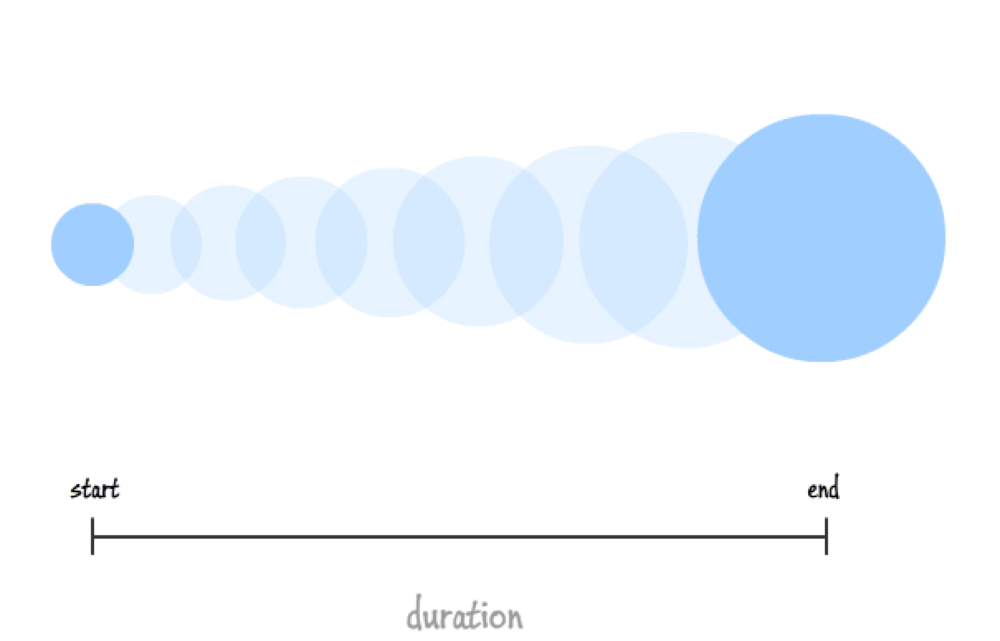
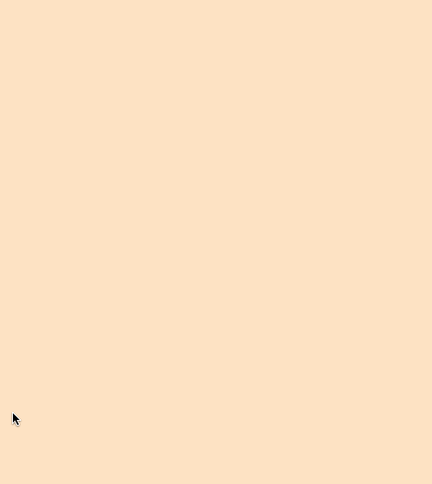
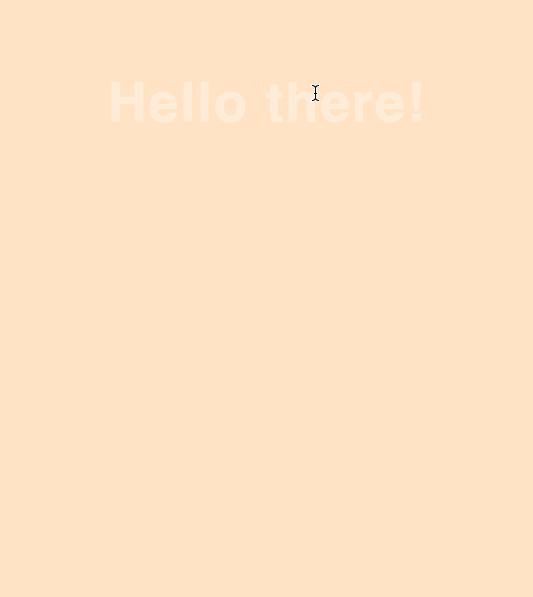
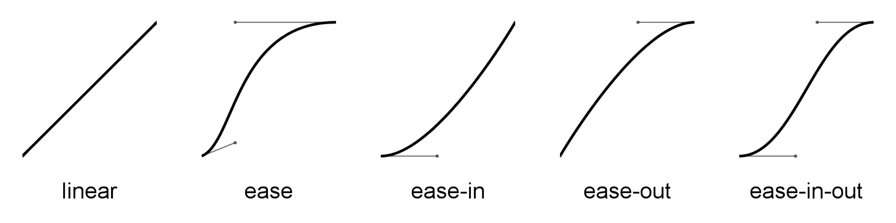
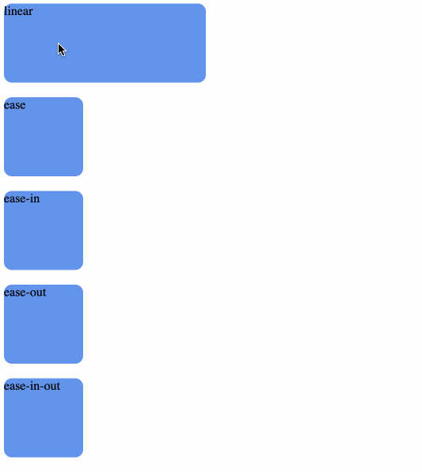
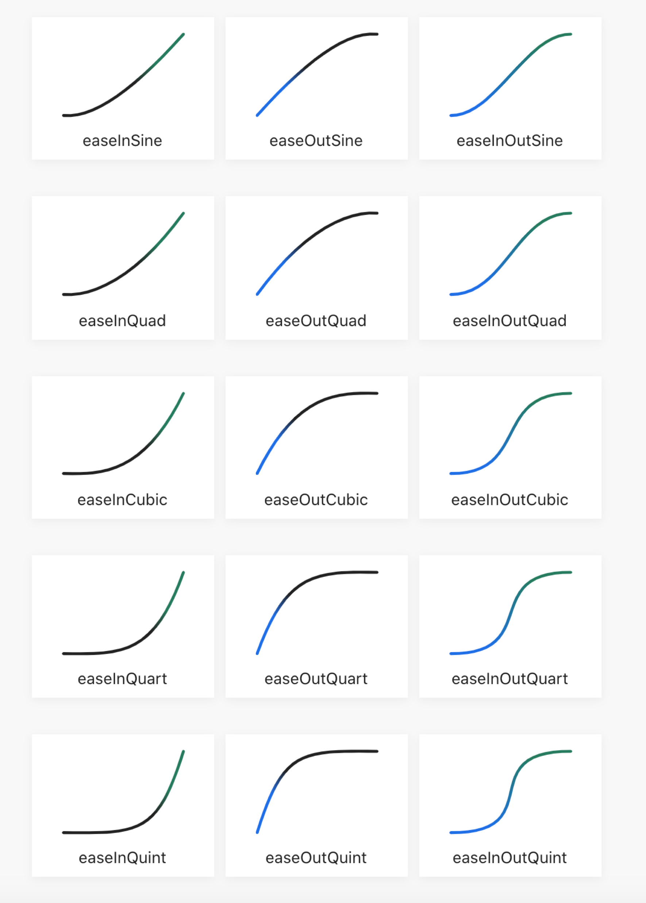
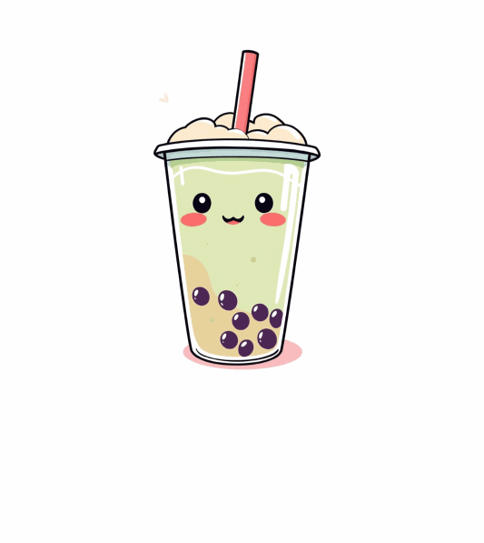

# Class 9

CSS Interactivity

Programming Interactivity

 ----

Harbour Space

---

## Agenda

<div style="text-align: left;">


01/ CSS Transitions

02/ Easing functions

03/ CSS Animations

04/ Excercise

</div>

---

## 01/ CSS Transitions

---

CSS transitions allows you to change property values smoothly, over a given duration.

Note:
- CSS transitions allows you to change property values smoothly, over a given duration.
- Can be used to add a smoothnes to a change. Lets say we add a scaling to a button hover, we could add a transition with duration to make it more smooth.

---

### CSS Transitions



Note:
- Here is a good example of resizing element;
- Instead of it going from one size to another, we can add this transition with a duration.

---

### CSS Transitions

``` javascript
.color {
  /* transition: background-color 500ms; */
  transition-property: background-color;
  transition-duration: 500ms;
  background-color: bisque;
}

.color:hover {
  background-color: cornflowerblue;
}
```

Note:
- Here we have a transition on background color change
- the transition property needs to have at least transition-property and transition-duration.

---



Note:
- with transition it will be like this

---


Note:
- without transition, it will be like this

---

### Fade Transition

``` css
.fade {
 /* transition: opacity 500ms; */
  transition-property: opacity;
  transition-duration: 500ms;
  opacity: 1;
}

.fade:hover {
  opacity: 0.1;
}
```


---



Note:
- Fade with transition

---


Note:
- Fade with no transition

---

``` css
 transition: opacity 500ms, background-color 500ms;
```

Note:
- Can have more then 1 property;

---

### Mandatory values

``` css
  transition-property: width;
  transition-duration: 3s;

  transition: width 3s;
```

---

### Possible values

``` css [4-7]
  transition-property: width;
  transition-duration: 3s;

  transition-timing-function: ease-in-out; 
  ease is deafault
  can be ease, linear, ease-in, ease-out
  ease-in-out, cubic-bezier(n,n,n,n)
```

---

### Possible values

``` css [5]
  transition-property: width;
  transition-duration: 3s;
  transition-timing-function: ease-in-out;

  transition-delay: 2s;
```

---

### Possible values

``` css [6-7]
  transition-property: width;
  transition-duration: 3s;
  transition-timing-function: ease-in-out;
  transition-delay: 2s;

  transition: [property*] [duration*] 
      [timing-function] [delay];
```

---

## 02/ Easing functions

---

## Easing functions

Easing functions let you vary the transitions's speed over the course of its duration.

---

### Build-in easing functions



ease is default

Note:
- Linear will go the same speed
- Ease will go slow fast slow
- ease-in will go slow at start
- ease-out will go slow in the end
- ease-in-out will slow start and end


---


Note:
- Linear will go the same speed
- Ease will go slow fast slow
- ease-in will go slow at start
- ease-out will go slow in the end
- ease-in-out will slow start and end

---


### Easing

``` css
.width {
 /* transition: width 3s ease-in-out; */
  transition-property: width;
  transition-duration: 3s;
  transition-timing-function: ease-in-out;
  width: 150px;
}

.width:hover {
  width: 1000px;
}
```

---

### Custom easing functions



Note:
- Here are some custom easing functions
- easings.net

---

<section data-background-iframe="https://easings.net/#" data-background-interactive>


---

### Custom Easings

``` css
.width {
  /* transition: width 3s cubic-bezier(0.22, 1, 0.36, 1); */
  transition-property: width;
  transition-duration: 3s;
  transition-timing-function: cubic-bezier(0.22, 1, 0.36, 1);
  width: 150px;
}

.width:hover {
  width: 1000px;
}
```


---

## 03/ CSS Animations

Notes:
- Lets now look at CSS Animations
- Animations are a more complex version of transitions. 
- We can have different states during a single animations for different properties of a css style.

---

### CSS Animations

CSS animations allow you to gradually change elements over a number of keyframes.

---

### Animation example

``` css
@keyframes bobbing {
  0% {
    transform: translateY(0);
  }
  50% {
    transform: translateY(-10px); /* Moves up slightly */
  }
  100% {
    transform: translateY(0); /* Returns to starting position */
  }
}

.swing.clicked {
  animation-name: bobbing;
  animation-duration: 4s;
}
```

Note:
- Is similar to transition
- Except we connect it with a keyframe that can do more
- It can do many things at different timings

---
``` css
  animation-name: animationName; /* mandatory */
  animation-duration: 1s; /* mandatory */
  animation-delay: 1s /* delay before start */
  animation-timing-function: ease-in-out; /* Easing functions */
  animation-iteration-count: infinite; /* number or infinite */
  animation-direction: normal; /* normal, reverse, alternate, alternate-reverse */
	animation-fill-mode: none; /* none, forward, backward, both */

  animation: [animation-name*] [animation-duration*] [animation-timing-function] [animation-delay] [animation-iteration-count] [animation-direction] [animation-fill-mode] [animation-play-state];
```

---

### Mandatory properties

``` css
  /* animation: animationName 1s; */
  animation-name: animationName;
  animation-duration: 1s;
```

Note:
- These are mandatory
- The animation name that refers to the keyframe animation
- and the duration of the animation

---

### Scale up animation

``` css
@keyframes scaleUp {
  from {
    transform: scale(0.8);
  }
  to {
    transform: scale(1);
  }
}

.swing.clicked {
  animation-name: scaleUp;
  animation-duration: 4s;
}
```

---

### Move up animation

``` css
@keyframes bobbing {
  0% {
    transform: translateY(0);
  }
  50% {
    transform: translateY(-10px); /* Moves up slightly */
  }
  100% {
    transform: translateY(0); /* Returns to starting position */
  }
}

.swing.clicked {
  animation-name: bobbing;
  animation-duration: 4s;
}
```

---



---

### The required animation properties

``` css
animation-name The name of the keyframe block you want to use.
animation-duration How long the animations takes to go from 0% to 100%
```

---

### Additional properties

``` css [4-7]
animation-name
animation-duration

animation-timing-function Defaults to ease, 
but has ease functions
ease - linear - ease-in - ease-out - 
ease-in-out - cubic-bezier
```

---

### Additional properties

``` css [5-7]
animation-name
animation-duration
animation-timing-function

animation-delay The number of seconds to delay 
the animation instead of playing right away
```

---

### Additional properties

``` css [6-9]
animation-name
animation-duration
animation-timing-function
animation-delay

animation-iteration-count The number of times you 
want to go from 0% to 100 %. 
Use infinite to never stop. 
Optional: defaults to 1.

```

---

### Additional properties

``` css [7-9]
animation-name
animation-duration
animation-timing-function
animation-delay
animation-iteration-count

animation-fill-mode The style the element 
ends at the end of animation
can be none, forwards(last), backwards(first), both
```

---

### Additional properties

``` css [8-10]
animation-name
animation-duration
animation-timing-function
animation-delay
animation-iteration-count
animation-fill-mode
 
 animation-direaction the direaction it takes, 
 can be normal, reverse, alternate(forward then backwards) 
 or alternate-reverse(backwards then forwards)
```

---

### All properties in one line

``` css
  animation: [animation-name*] [animation-duration*] 
  [animation-timing-function] [animation-delay] 
  [animation-iteration-count] [animation-direction] 
  [animation-fill-mode] [animation-play-state];
```

---

### Custom keyframes

---

## 04/ Excercise